## 总体界面
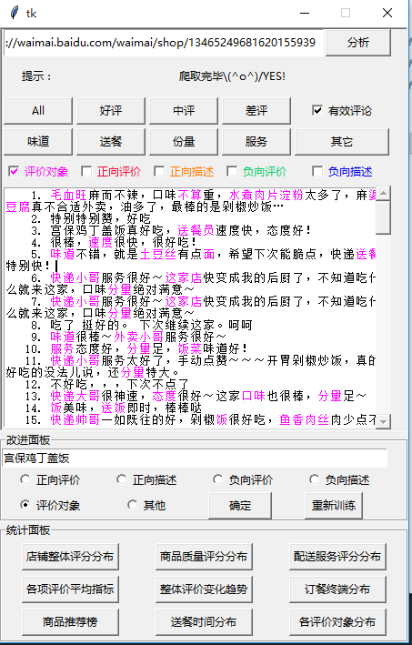

## 实时爬取
输入百度外卖店铺的一个url地址，实时爬取店铺评论。
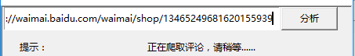

## 评论分类、有效性检测
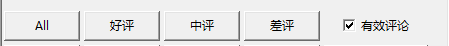

## 评价对象分类
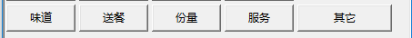

## 颜色标记
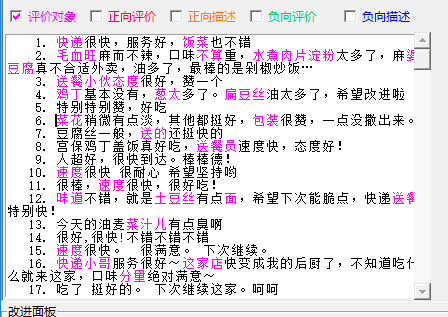

## 属性-观点对抽取
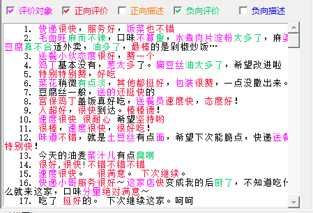

## 有监督的学习、用户自定义
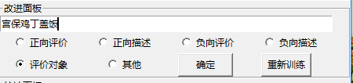

## 统计面板
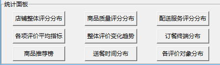

### 店铺整体评分分布
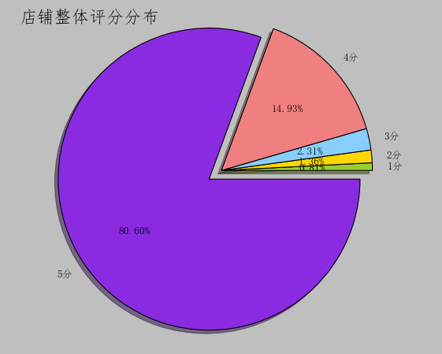

### 商品质量评分分布
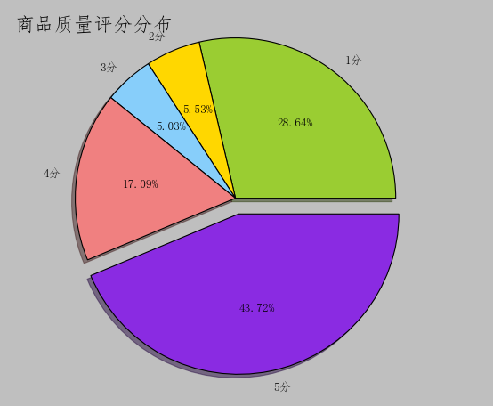

### 配送服务评分分布
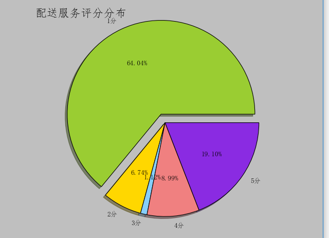

### 各项评价平均指标
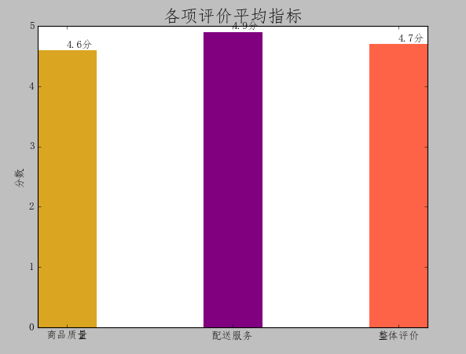

### 整体评价变化趋势
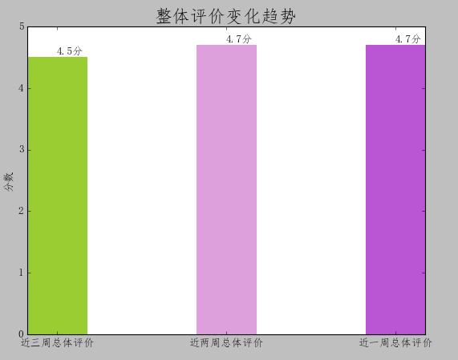

### 订餐终端分布

### 商品推荐榜
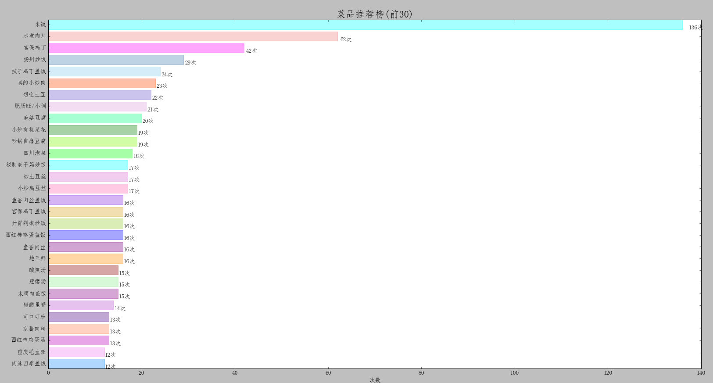

### 送餐时间分布
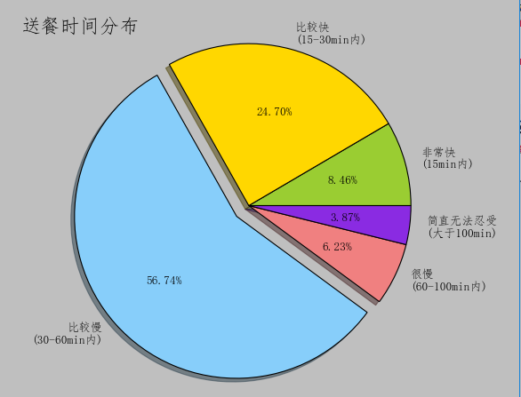

### 各评价对象分布
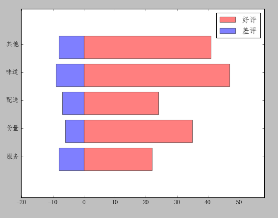
